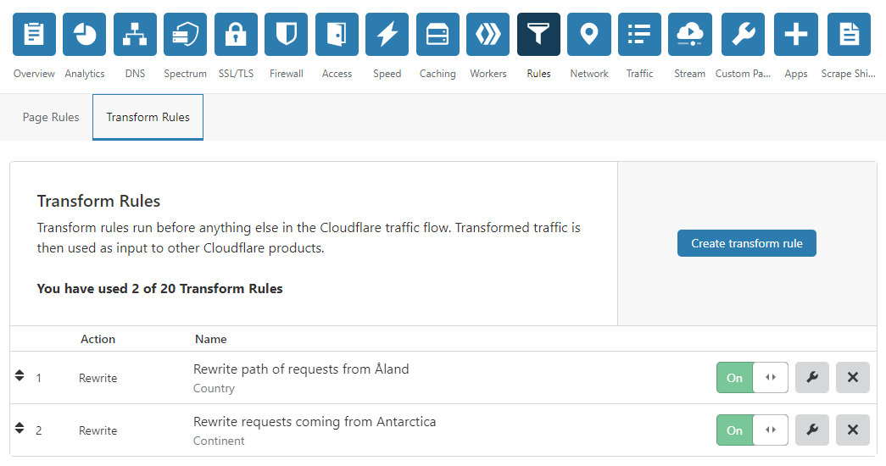

# About Cloudflare Transform Rules

Transform Rules allow you to make adjustments to incoming requests at the edge before they go through any other Cloudflare products. 

You can perform the following actions:

- Rewrite the **path** of the URL of an HTTP request
- Rewrite the **query string** of the URL of an HTTP request

A Transform Rule can perform a **static rewrite** or a **dynamic rewrite**. Static rewrites replace a given part of a request URL (path or query string) with a static string. Dynamic rewrites allow you to support more advanced scenarios where you use an [expression](https://developers.cloudflare.com/firewall/cf-firewall-rules/fields-and-expressions) to define the resulting path or query string.

To configure Transform Rules from the Cloudflare dashboard, use the **Transform Rules** tab in Rules. For more, see [Manage Transform Rules](/transform/manage).

## Rewrites and redirects 

You can manipulate the URL of a request through different operations, namely through rewrites and redirects. 

A **rewrite** is a server-side operation that occurs before a web server has fully processed a request. A rewrite is not visible to website visitors, since the URL displayed in the browser does not change. 

A **redirect** is a client-side operation that occurs after the web server has loaded the initial URL. In this case, a website visitor can see the URL changing when the redirect occurs.
You can configure transform rules in the Cloudflare UI (the dashboard) to perform rewrites at the edge, without reaching your web server. 

<Aside type='note' header='Note'>

Check [Configuring URL forwarding or redirects with Cloudflare Page Rules](https://support.cloudflare.com/hc/articles/200172286) in the Support KB to learn more about configuring redirects.

</Aside>

## Transform Rules tab

The **Rules List** gives you an overview of the configured Transform Rules for the current zone and allows you to manage these rules in a single convenient location.

## Entitlements

Cloudflare Transform Rules are available to all customers. Keep in mind that support for regular expressions is based on your plan type.

This table outlines the Transform Rules features and entitlements available with each customer plan:

<TableWrap>

Feature                    | Free | Pro | Business | Enterprise
---------------------------|------|-----|----------|-----------
Active rules               | 2    | 5   | 10       | 20
Regular expression support | No   | No  | Yes      | Yes

</TableWrap>

## Get started

Review the [difference between rewrites and redirects](#rewrites-and-redirects) to understand the actions you can perform with a Transform Rule.

To get started building your own Transform Rules, see [Manage Transform Rules](/transform/manage).

Those eager to dive straight into the technical details can refer to these topics:

- [Common use cases](/transform/use-cases)
- Transform Rules language – Check [Firewall Rules language](https://developers.cloudflare.com/firewall/cf-firewall-language), since the language of Transform Rules is the same as the Firewall Rules language.
